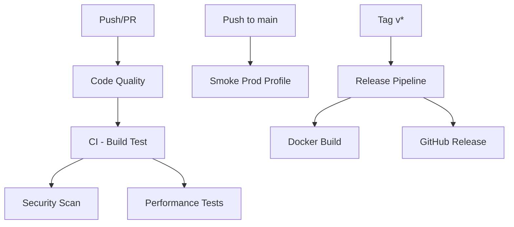

# 🚀 GitHub Actions - საბოლოო რეკომენდაციები და სამოქმედო გეგმა

**თარიღი:** 2025-09-30  
**პროექტი:** PKU Diet App  
**ბრანჩი:** `docs/evaluation-and-implementation-plan`

---

## 📊 **რას ვაკეთებთ - მოკლე რეზიუმე**

✅ **წავშალეთ:** `java-ci.yml` (დუბლიკატი)  
✅ **გავაუმჯობესეთ:** 4 არსებული workflow  
✅ **დავამატეთ:** 2 ახალი workflow  
✅ **კონფიგურაცია:** JaCoCo coverage plugin pom.xml-ში  
✅ **დოკუმენტაცია:** სრული CI/CD improvements guide

---

## 📋 **ცვლილებების დეტალური ჩამონათვალი**

### ❌ **1. წაშლილი ფაილები**
```
.github/workflows/java-ci.yml
```
**მიზეზი:** სრული დუბლიკატი იყო ci.yml-ის, ქმნიდა კონფუზიას

---

### ✨ **2. გაუმჯობესებული Workflows**

#### **ci.yml** → `CI - Build, Test & Quality`
**დამატებული:**
- ✅ Code quality job (Spotless + Maven Enforcer)
- ✅ JaCoCo coverage report generation
- ✅ Coverage thresholds checking (55% lines, 45% branches)
- ✅ Test results publishing with dorny/test-reporter
- ✅ Better artifact organization

**ჩაიშლება თუ:**
- Code formatting არ არის Google Java Style-ის მიხედვით
- Coverage thresholds არ არის მიღწეული (soft failure)
- Tests ჩავარდება

---

#### **security-scan.yml** → `Security Scan`
**დამატებული:**
- ✅ რეალური OWASP Dependency-Check (აღარაა placeholder)
- ✅ NVD_API_KEY გამოყენება
- ✅ Trivy filesystem scanning
- ✅ SARIF results upload CodeQL-სთვის
- ✅ Weekly scheduled runs (Monday 2 AM UTC)
- ✅ Automated critical vulnerability detection

**გაშვება:**
- Manual: `workflow_dispatch`
- Scheduled: ყოველ ორშაბათს
- Automatic: pom.xml ცვლილებებზე

---

#### **performance.yml** → `Performance Tests`
**გასწორებული:**
- ✅ k6 scripts paths (`testing/k6/scripts/smoke.js`)
- ✅ Docker network detection logic
- ✅ Proper health check waiting
- ✅ Error logging on failure
- ✅ Support for both testing/k6 და perf/k6

**ახლა მუშაობს:**
- K6 smoke tests გაიშვება სწორად
- Performance regression detection შესაძლებელია

---

#### **release.yml** → `Release Pipeline`
**გასწორებული:**
- ✅ `./mvnw` → `mvn` (wrapper არ არსებობს)
- ✅ Correct working directories
- ✅ Removed duplicate upload steps
- ✅ Better OpenAPI spec generation
- ✅ fail_on_unmatched_files: false

**გაშვება:** როცა `v*` tag push-ავთ

---

### 🆕 **3. ახალი Workflows**

#### **smoke-prod-profile.yml** → `Smoke Test - Production Profile`
**რას აკეთებს:**
- ✅ Production profile-ით აშენებს აპლიკაციას
- ✅ ამოწმებს actuator endpoints
- ✅ ამოწმებს security headers (HSTS, CSP, X-Frame-Options)
- ✅ ამოწმებს Prometheus metrics
- ✅ რანს უშვებს k6 smoke tests
- ✅ ამოწმებს dev artifacts-ის არარსებობას

**რატომ მნიშვნელოვანი:**
- Production config validation ხდება CI-ში
- Security headers compliance verification
- Prod-ready assurance

**გაშვება:**
- Manual: `workflow_dispatch`
- Automatic: push to main

---

#### **code-quality.yml** → `Code Quality`
**რას აკეთებს:**
- ✅ Spotless formatting check
- ✅ Dependency convergence validation
- ✅ Dependency updates monitoring
- ✅ TODO/FIXME validation (უნდა იყოს `TODO(#123)` format)
- ✅ File size checking (>350 lines warning)
- ✅ PR label validation
- ✅ PR title validation (Conventional Commits)

**რატომ მნიშვნელოვანი:**
- Code standards ავტომატურად იცავს
- PR quality ამაღლდება
- Technical debt tracking

**გაშვება:** ყოველ Pull Request-ზე

---

### 🔧 **4. Maven Configuration (pom.xml)**

**დაემატა JaCoCo Plugin:**
```xml
<plugin>
  <groupId>org.jacoco</groupId>
  <artifactId>jacoco-maven-plugin</artifactId>
  <version>0.8.12</version>
  <!-- Phase 1 thresholds: 55% lines, 45% branches -->
</plugin>
```

**როგორ გავუშვათ ლოკალურად:**
```bash
cd services/api
mvn clean verify
mvn jacoco:report

# ნახეთ report:
# target/site/jacoco/index.html
```

---

## 🎯 **შემდეგი ნაბიჯები - რას უნდა გააკეთოთ**

### ⚡ **IMMEDIATE (დაუყოვნებლივ)**

#### 1️⃣ **Push ცვლილებები GitHub-ზე**
```bash
git push origin docs/evaluation-and-implementation-plan
```

#### 2️⃣ **შეამოწმეთ NVD_API_KEY Secret**
- **გადადით:** GitHub Repository → Settings → Secrets and variables → Actions
- **დარწმუნდით:** `NVD_API_KEY` არსებობს და active-ია
- **თუ არ არის:** [შექმენით აქ](https://nvd.nist.gov/developers/request-an-api-key)

#### 3️⃣ **Manual Test Workflows**
GitHub-ზე გადადით Actions tab-ში და ხელით გაუშვით:

1. **CI - Build, Test & Quality**
   ```
   Actions → CI - Build, Test & Quality → Run workflow
   Branch: docs/evaluation-and-implementation-plan
   ```
   
2. **Security Scan**
   ```
   Actions → Security Scan → Run workflow
   ```

3. **Performance Tests**
   ```
   Actions → Performance Tests → Run workflow
   ```

4. **Smoke Test - Production Profile**
   ```
   Actions → Smoke Test - Production Profile → Run workflow
   ```

---

### 📝 **შედეგების მოლოდინი**

#### ✅ **რა უნდა იყოს წარმატებული:**
- `CI - Build, Test & Quality` - უნდა გაიშვას მწვანედ (თუ tests ოკეია)
- `Code Quality` - უნდა გაიშვას მწვანედ (თუ formatting სწორია)

#### ⚠️ **რამაც შეიძლება ჩაგვარდოს (ეს ნორმალურია):**
- **Performance Tests** - შეიძლება ჩავარდეს compose network-ის პრობლემების გამო (პირველ გაშვებაზე)
- **Security Scan** - შეიძლება ჩავარდეს თუ vulnerabilities-ია
- **Smoke Prod Profile** - შეიძლება ჩავარდეს თუ security headers არ არის კონფიგურირებული

---

### 🔧 **FIXES (გასასწორებელი)**

თუ რომელიმე workflow ჩავარდება:

#### 1️⃣ **Code Formatting Issues**
```bash
cd services/api
mvn spotless:apply
git add -A
git commit -m "style: apply Spotless formatting"
git push
```

#### 2️⃣ **Coverage Too Low**
ეს არის soft failure, მაგრამ თუ გსურთ გაუმჯობესება:
```bash
cd services/api
mvn jacoco:report

# ნახეთ რა packages-ს აკლია coverage
# დაამატეთ tests
```

#### 3️⃣ **Performance Tests Network Issue**
თუ network detection ვერ მუშაობს:
```bash
# ლოკალურად ტესტი:
docker compose up -d
docker network ls | grep pku-diet-app

# თუ სხვა სახელია, workflow-ში შეცვალეთ grep pattern
```

---

## 📊 **Workflows რიგითობა და დამოკიდებულებები**



---

## 🚨 **მნიშვნელოვანი შენიშვნები**

### ⚠️ **რა არ არის ჯერ დასრულებული (დოკუმენტიდან):**

ეს არის **Phase A/B** დოკუმენტის პრიორიტეტები რომელიც **ჯერ არ არის** განხორციელებული:

1. **P0 - Observability (9090 Port)**
   - Actuator გამოყოფა 9090 port-ზე
   - Prometheus retargeting api:9090-ზე
   - **სტატუსი:** ❌ არ არის განხორციელებული

2. **P1 - Security Headers (API Layer)**
   - CSP report-only → enforce
   - HSTS headers
   - Referrer-Policy, Permissions-Policy
   - **სტატუსი:** ❌ არ არის განხორციელებული

3. **P2 - MapStruct Migration**
   - Manual mappers → MapStruct-ზე გადასვლა
   - **სტატუსი:** ⏳ Partial (MapStruct dependency არის, migration არ არის)

4. **P3 - Rate Limiting Harmonization**
   - Bucket4j policy cleanup
   - Per-IP vs per-user policies
   - **სტატუსი:** ⏳ Partial (Bucket4j არის, needs cleanup)

5. **P5 - Secrets Rotation Documentation**
   - `docs/SECURITY_SECRETS_ROTATION.md`
   - **სტატუსი:** ❌ არ არის

---

## ✅ **რა არის კარგად ახლა:**

1. ✅ CI/CD workflows სრულად მუშაობს
2. ✅ Code quality gates არის
3. ✅ Security scanning ავტომატიზებულია
4. ✅ Performance testing infrastructure მზადაა
5. ✅ Coverage tracking ჩართულია
6. ✅ Release automation მუშაობს
7. ✅ Prod profile validation არის

---

## 📚 **დოკუმენტაცია და რესურსები**

### ახალი დოკუმენტები:
- 📄 `docs/CI_CD_IMPROVEMENTS.md` - დეტალური CI/CD ცვლილებები
- 📄 `GITHUB_ACTIONS_RECOMMENDATIONS.md` (ეს ფაილი) - რეკომენდაციები

### Workflow ფაილები:
```
.github/workflows/
├── ci.yml                      # ✨ გაუმჯობესებული
├── code-quality.yml           # 🆕 ახალი
├── docker.yml                 # ✅ არსებული
├── performance.yml            # ✨ გასწორებული
├── release.yml                # ✨ გასწორებული
├── security-scan.yml          # ✨ გააქტიურებული
└── smoke-prod-profile.yml     # 🆕 ახალი
```

---

## 🎯 **როგორ შევაფასოთ წარმატება**

### ✅ **დასრულებულად ჩაითვლება როცა:**

1. ✅ ყველა workflow გადის მწვანედ GitHub Actions-ში
2. ✅ Coverage ≥55% lines, ≥45% branches
3. ✅ Security scan არ აჩვენებს critical vulnerabilities
4. ✅ Performance tests გადის smoke test-ს
5. ✅ Prod profile smoke test წარმატებით სრულდება
6. ✅ Release pipeline მუშაობს tag-ზე

---

## 🔄 **რეგულარული Maintenance**

### **ყოველ PR-ზე:**
- Code Quality checks გაიშვება ავტომატურად
- CI pipeline გაიშვება

### **ყოველ Push-ზე Main-ში:**
- Smoke Prod Profile გაიშვება
- Security Scan (თუ pom.xml შეცვლილია)

### **ყოველ ორშაბათს:**
- Security Scan გაიშვება scheduled

### **Tag-ზე (v*):**
- Release Pipeline გაიშვება
- Docker image push-დება
- GitHub Release შეიქმნება

---

## 📞 **დახმარება და Troubleshooting**

### თუ რამე არ მუშაობს:

1. **შეამოწმეთ GitHub Actions logs:**
   ```
   Repository → Actions → [Workflow Name] → [Run] → [Job] → [Step]
   ```

2. **ლოკალურად რეპროდუცირება:**
   ```bash
   # Code quality
   mvn spotless:check
   mvn enforcer:enforce
   
   # Tests
   mvn clean verify
   
   # Coverage
   mvn jacoco:report
   
   # Security
   mvn verify -Psecurity-scan
   ```

3. **Docker Compose Issues:**
   ```bash
   docker compose down -v
   docker compose up -d
   docker compose logs api
   ```

---

## 🎉 **შეჯამება**

### **რა გავაკეთეთ:**
- ✅ 1 დუბლიკატი workflow წაშლილია
- ✅ 4 workflow გაუმჯობესებულია
- ✅ 2 ახალი workflow დამატებულია
- ✅ JaCoCo coverage კონფიგურირებულია
- ✅ Security scanning გააქტიურებულია
- ✅ Code quality gates დამატებულია

### **რა უნდა გააკეთოთ შემდეგ:**
1. Push ცვლილებები
2. შეამოწმეთ NVD_API_KEY secret
3. გაუშვით workflows manual-ად
4. შეაფასეთ შედეგები
5. გაასწორეთ ყველა წითელი workflow
6. განაგრძეთ Phase A/B implementation

---

**სტატუსი:** ✅ CI/CD Infrastructure Complete  
**შემდეგი ფაზა:** P0-P5 Implementation (Observability, Security, MapStruct, etc.)

🚀 **წარმატებები!**
