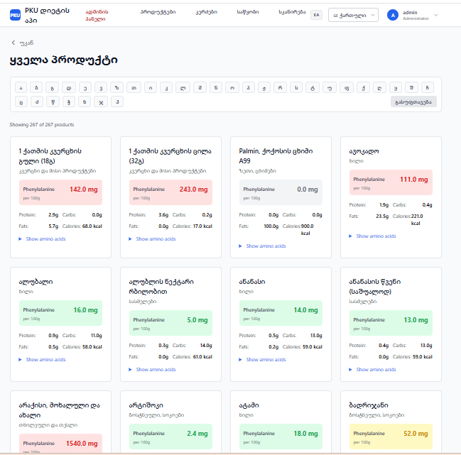
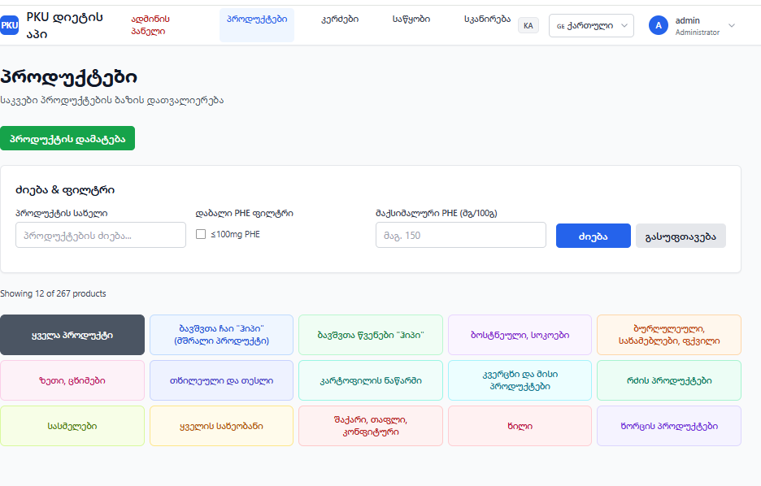
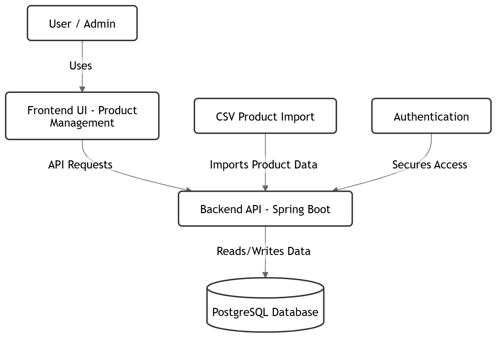

# PKU Diet Management System

## Overview
Business-oriented system designed to support structured dietary management for individuals with PKU.

The project focuses on translating strict domain rules and user needs into a functional system with clear workflows and data structure.

## Business Context
- PKU requires strict dietary control and continuous monitoring
- Users need a reliable way to track and manage food intake
- Data consistency and validation are critical
- The system is designed to simplify daily diet planning and tracking

## My Role
This project is part of my transition into an IT Business Analyst role.

Focus areas:
- understanding the problem domain
- defining system workflows
- structuring business logic
- translating requirements into system behavior
- organizing data and interactions

## Core System Functions
- user registration and authentication
- diet and intake tracking
- food data handling
- validation of user input
- storage and retrieval of structured records

## Business Logic / Rules
- users must provide complete intake data before submission
- entries must follow predefined dietary constraints
- system validates inputs before storing data
- records must be structured for consistent daily tracking
- user interactions must result in traceable data entries

## User Flow
1. user logs into the system
2. user selects or enters food intake
3. system validates input
4. data is stored in structured format
5. user reviews tracking data

## System Structure
- Frontend: Planned as future user interaction layer
- Backend: Java 21 with Spring Boot REST API
- Database: PostgreSQL

## Main Data Entities
- User
- Food Item
- Intake Record
- Meal Plan
- Nutritional Data

## Project Status
Work in progress.

Current focus:
- improving system structure
- refining documentation
- strengthening business logic clarity

## What This Project Demonstrates
- ability to translate a business problem into a system
- understanding of workflows and requirements
- structured thinking around data and logic
- technical awareness for collaboration with developers

## Screenshots
- TODO: add main workflow screenshot
- TODO: add data view screenshot
- TODO: add validation/logic screenshot

## Screenshots

### All Products View

### Product Management View

### System Structure
